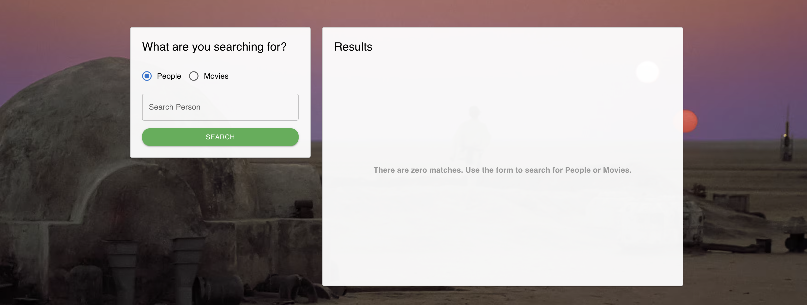
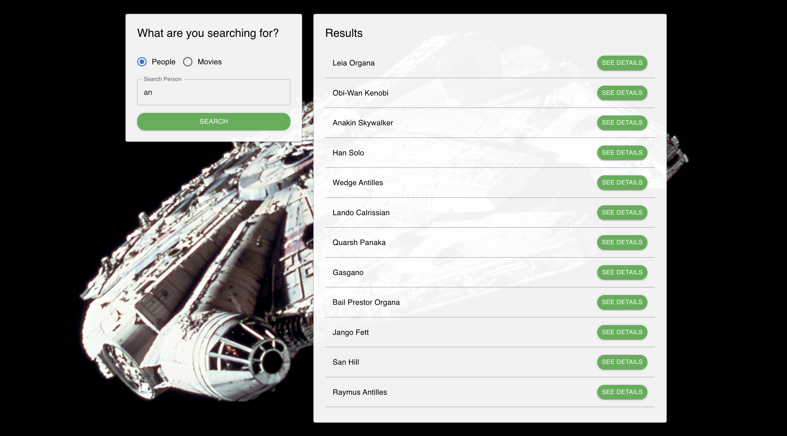
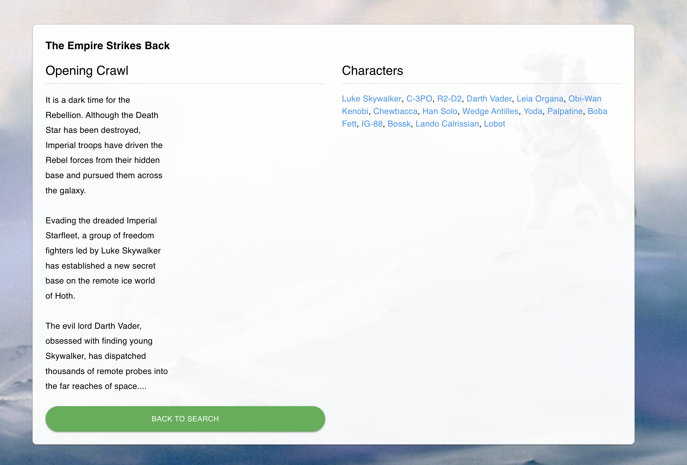
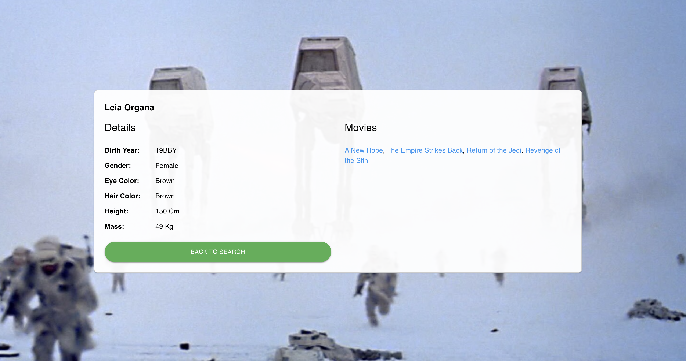

# Lawnstarter Star Wars Front End App

## React + TypeScript + Vite

I have worked with Vue in the past, but I used React here. I always use Typescript.

## API Client
The API is accessed via `frontend/src/api/client.ts` and is used by the three views, `Home.tsx`, `MovieDetail.tsx` and `PersonDetail.tsx`.

## CSS
I made an effort to match what I saw, then give it a little twist. 

## Docker
This application runs in the `frontend` container. Run `docker ps` to see all containers. See the root `README.md` for more information.
